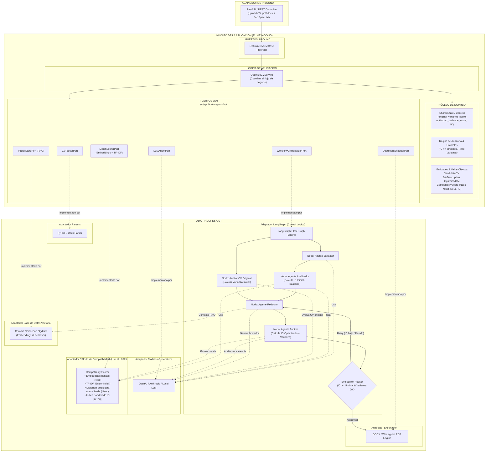

```mermaid
flowchart TB
    %% ==========================================
    %% CAPA DE ADAPTADORES INBOUND
    %% ==========================================
    subgraph InboundAdapters["ADAPTADORES INBOUND<br/>src/infrastructure/adapters/inbound"]
        direction TB
        API["FastAPI / REST Controller<br/>(Upload CV .pdf/.docx + Job Spec .txt)"]
    end

    %% ==========================================
    %% HEXÁGONO CENTRAL: DOMINIO Y APLICACIÓN
    %% ==========================================
    subgraph Hexagon["NÚCLEO DE LA APLICACIÓN (EL HEXÁGONO)"]
        direction TB
        
        subgraph PortsIn["PUERTOS INBOUND<br/>src/application/ports/inbound"]
            P_In["OptimizeCVUseCase<br/>(Interfaz)"]
        end

        subgraph Application["LÓGICA DE APLICACIÓN"]
            Service["OptimizeCVService<br/>(Coordina el flujo de negocio)"]
        end

        subgraph Domain["NÚCLEO DE DOMINIO"]
            State["SharedState / Context<br/>(original_variance_score,<br/>optimized_variance_score, IC)"]
            AuditRules["Reglas de Auditoría & Umbrales<br/>(IC >= threshold, Filtro Varianza)"]
            Entities["Entidades & Value Objects:<br/>CandidateCV, JobDescription, OptimizedCV,<br/>CompatibilityScore (Ncos, Ntfidf, Neuc, IC)"]
        end

        subgraph PortsOut["PUERTOS OUT<br/>src/application/ports/out"]
            P_Parser["CVParserPort"]
            P_Graph["WorkflowOrchestratorPort"]
            P_LLM["LLMAgentPort"]
            P_Scorer["MatchScorerPort<br/>(Embeddings + TF-IDF)"]
            P_Vector["VectorStorePort (RAG)"]
            P_Export["DocumentExporterPort"]
        end

        P_In --> Service
        Service --> Domain
        Service --> PortsOut
    end

    %% ==========================================
    %% CAPA DE ADAPTADORES OUT
    %% ==========================================
    subgraph OutboundAdapters["ADAPTADORES OUT<br/>src/infrastructure/adapters/out"]
        direction TB

        subgraph AdapterParsers["Adaptador Parsers"]
            PDFParser["PyPDF / Docx Parser"]
        end

        subgraph AdapterGraph["Adaptador LangGraph (Control Lógico)"]
            direction TB
            LG_Engine["LangGraph StateGraph Engine"]
            NodeExt["Nodo: Agente Extractor"]
            NodeAna["Nodo: Agente Analizador<br/>(Calcula IC Inicial - Baseline)"]
            NodeOrigAud["Nodo: Auditor CV Original<br/>(Calcula Varianza Inicial)"]
            NodeWri["Nodo: Agente Redactor"]
            NodeAud["Nodo: Agente Auditor<br/>(Calcula IC Optimizado + Varianza)"]
            EdgeCond{"Evaluación Auditor<br/>(IC >= Umbral & Varianza OK)"}

            LG_Engine --> NodeExt --> NodeAna --> NodeWri
            LG_Engine --> NodeOrigAud --> NodeWri
            NodeWri --> NodeAud --> EdgeCond
            EdgeCond -- "Retry (IC bajo / Desvío)" --> NodeWri
        end

        subgraph AdapterLLM["Adaptador Modelos Generativos"]
            LLM_API["OpenAI / Anthropic / Local LLM"]
        end

        subgraph AdapterScorer["Adaptador Cálculo de Compatibilidad (Li et al., 2025)"]
            ScorerEngine["Compatibility Scorer<br/>• Embeddings densos (Ncos)<br/>• TF-IDF léxico (Ntfidf)<br/>• Distancia euclidiana normalizada (Neuc)<br/>• Índice ponderado IC [0,100]"]
        end

        subgraph AdapterRAG["Adaptador Base de Datos Vectorial"]
            VDB["Chroma / Pinecone / Qdrant<br/>(Embeddings & Retriever)"]
        end

        subgraph AdapterExport["Adaptador Exportador"]
            DocGen["DOCX / Weasyprint PDF Engine"]
        end
    end

    %% Conexiones Primarias
    API --> P_In

    %% Conexiones Secundarias (Puertos a Adaptadores)
    P_Parser -. Implementado por .-> PDFParser
    P_Graph -. Implementado por .-> LG_Engine
    P_LLM -. Implementado por .-> LLM_API
    P_Scorer -. Implementado por .-> ScorerEngine
    P_Vector -. Implementado por .-> VDB
    P_Export -. Implementado por .-> DocGen

    %% Interacciones de los Nodos con Servicios e Infraestructura
    NodeExt -. Usa .-> LLM_API
    NodeAna -. Usa .-> ScorerEngine
    NodeAna -. Usa .-> LLM_API
    NodeOrigAud -. Evalúa CV original .-> LLM_API
    NodeWri -. Contexto RAG .-> VDB
    NodeWri -. Genera borrador .-> LLM_API
    NodeAud -. Evalúa match .-> ScorerEngine
    NodeAud -. Audita consistencia .-> LLM_API
    EdgeCond -- "Approved" --> DocGen
```